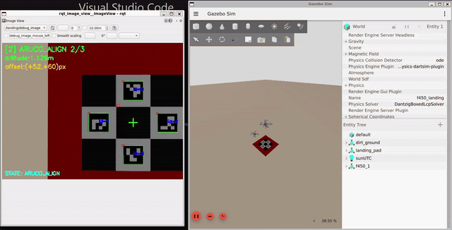
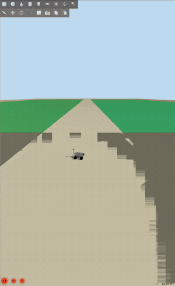
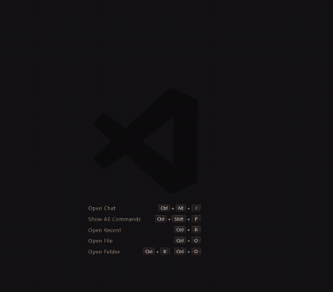
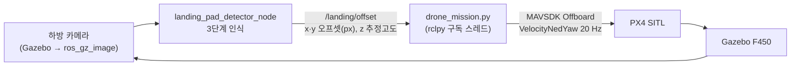
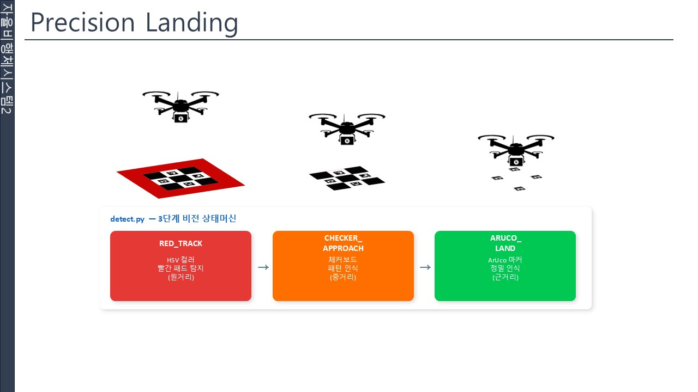
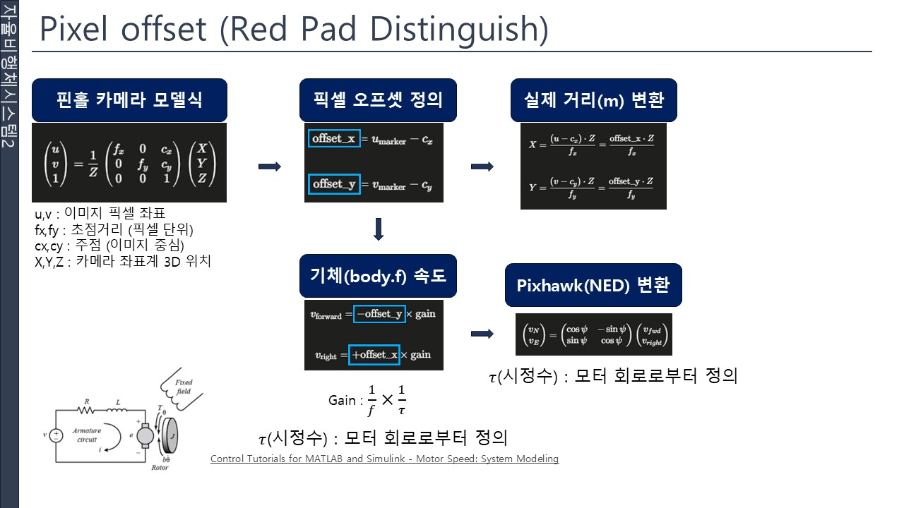
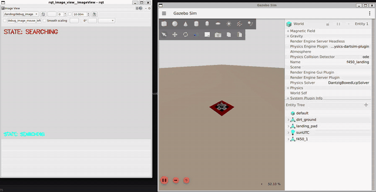
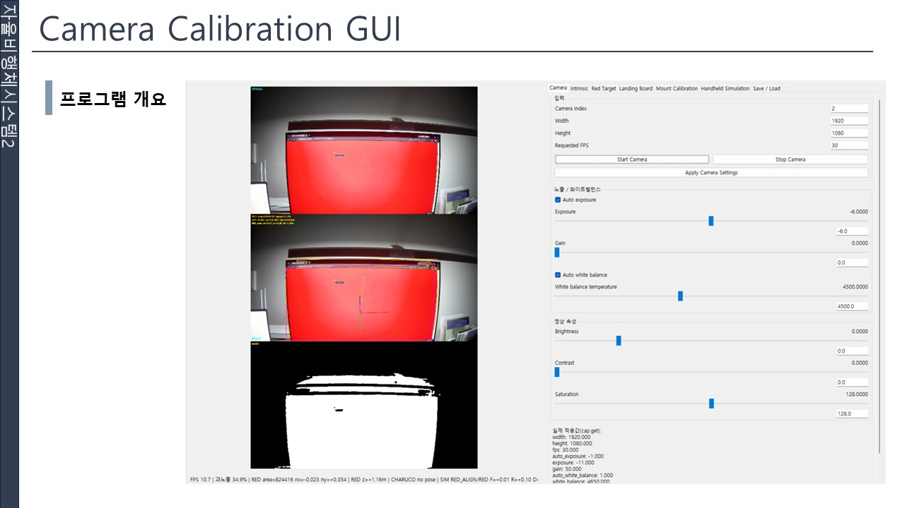
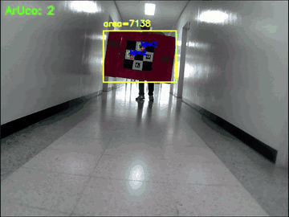
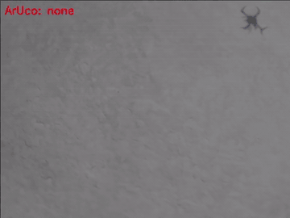

# F450 Vision-based Precision Landing

F450 드론과 로버(R1 / HBX 16889)가 협동하는 **농업 방역 미션**의 ROS 2 워크스페이스입니다. PX4 SITL과 Gazebo Harmonic 위에서 드론이 농경지를 방역한 뒤, 카메라로 **적색 패드 → 체커보드 → ArUco 마커**를 차례로 인식해 로버 위 착륙 패드에 정밀착륙합니다.

<p align="center">
<br>
<sub>왼쪽: 하방 카메라 인식 화면 (<code>/landing/debug_image</code>) · 오른쪽: Gazebo. 최종 채택한 P 제어로 고도 10 m에서 ArUco 패드 중앙에 정렬하며 하강</sub>
</p>

| 문서 | 내용 |
|---|---|
| [시뮬레이션 구축 과정](docs/simulation_setup.md) | 로버·F450 모델 제작(CAD 물성치 → Xacro/URDF → SDF), 추력·토크 계수 산정, Gazebo 환경 |
| [비전 기반 정밀착륙 알고리즘](docs/vision_landing_algorithm.md) | 3단계 인식, 픽셀 오프셋 → 속도 명령 변환, 하강 로직, 카메라 캘리브레이션 GUI |
| [실기체 하드웨어](docs/hardware.md) | 착륙 패드, 전원 구성 사진 |

---

## 개발 과정

| 단계 | 기간 | 내용 | 영상 |
|---|---|---|---|
| 1. 시뮬레이션 환경 구축 | 2026.05 초 | PX4 SITL + Gazebo 농경지 월드(farmland A~D), R1 로버 키보드(WASD) 주행 | [01](docs/videos/01_rover_teleop_farmland.mp4) |
| 2. 드론·로버 멀티 SITL | 2026.05 말 | F450 모델 제작, MAVSDK Offboard 이동 테스트, 로버 이동 → 드론 방역(지그재그) → 복귀 미션 | [02](docs/videos/02_drone_offboard_test_farmland.mp4) |
| 3. 비전 기반 정밀착륙 | 2026.06 | 착륙 패드 3단계 인식 노드, ROS 2 ↔ MAVSDK 오프셋 연동, 속도 제어 착륙 | [03](docs/videos/03_precision_landing_attempt_1.mp4) · [04](docs/videos/04_precision_landing_attempt_2.mp4) |
| 4. 제어기 비교 (PD → P) | 2026.06 말 | PD 제어를 시험한 뒤 P 제어 + 하강 결합 방식을 최종 채택 ([비교](#3-p-제어-vs-pd-제어)) | [05 (PD)](docs/videos/05_precision_landing_PD.mp4) · [**06 (P, 최종)**](docs/videos/06_precision_landing_P_final.mp4) |
| 5. 실환경 인식 검증 | 2026.06 말 | 실제 착륙 패드와 카메라로 인식 거리 시험, 기체 탑재 후 비행 중 하방 카메라 인식 확인 ([실환경 검증](#실환경-검증)) | [07](docs/videos/07_real_pad_detection_range_test.mp4) · [08](docs/videos/08_real_flight_camera_test.mp4) |

> 1~2단계는 [px4-drone-rover-sim](https://github.com/sjuaero/px4-drone-rover-sim)에서 진행한 초기 버전이며, 모델·월드·스크립트를 이 저장소로 통합했습니다. 당시의 방역 미션 스크립트는 [`scripts/spray_mission.py`](scripts/spray_mission.py)로 보존했습니다.

<p>


</p>
<p><sub>왼쪽부터: R1 로버 키보드 주행 · F450 Offboard 이동 테스트(전·후·좌·우)</sub></p>

전체 영상은 [`docs/videos/`](docs/videos)에 있습니다. GitHub 파일 화면에서 **View raw** 또는 다운로드로 재생할 수 있습니다.

---

## 시뮬레이션 구축

정밀착륙 제어를 믿고 시험하려면 모델의 형상과 물성치가 실제와 가까워야 합니다. 그래서 로버와 드론 모두 CAD에서 구한 값을 모델에 넣었습니다. 자세한 과정은 [시뮬레이션 구축 과정](docs/simulation_setup.md)에 있습니다.

<table>
<tr>
<td width="50%"></td>
<td width="50%"></td>
</tr>
<tr>
<td><b>로버</b>: CAD에서 부품의 부피·질량·관성모멘트를 구해 Xacro에 반영하고 URDF → SDF로 변환</td>
<td><b>F450</b>: CATIA 모델의 질량·무게중심·관성 텐서를 SDF <code>base_link</code>에 반영</td>
</tr>
<tr>
<td></td>
<td></td>
</tr>
<tr>
<td><b>추력·토크 계수</b>: 프로펠러 성능 데이터와 호버링 조건으로 반복 계산해 $b$, $d$ 결정</td>
<td><b>모터 모델</b>: 구한 계수를 Gazebo <code>MulticopterMotorModel</code> 플러그인에 입력</td>
</tr>
</table>

- 형상을 알 수 없는 로버 차체 부품은 박스·실린더 같은 기본 도형과 관성모멘트 공식으로 대체했습니다.
- 추력은 $T = b\,\omega^2$, 반토크는 $Q = d\,\omega^2$로 모델링하고, $b = C_T\,\rho\,D^4 / 4\pi^2$ 관계로 계수를 구했습니다.
- ROS 2·Gazebo는 ENU, PX4는 NED 좌표계를 쓰므로 카메라 오프셋을 속도 명령으로 바꿀 때 축 방향을 맞췄습니다.

---

## 정밀착륙 알고리즘



설계 배경과 수식 유도, 카메라 캘리브레이션은 [비전 기반 정밀착륙 알고리즘](docs/vision_landing_algorithm.md)에 자세히 정리했습니다.

### 1) 착륙 패드 3단계 인식 (`landing_pad_detector_node.py`)

<p align="center"></p>

| 상태 | 전환 조건 | 인식 대상 | 고도 추정 |
|---|---|---|---|
| `RED_TRACK` | 적색 영역만 보일 때 (원거리) | HSV 적색 마스크 → 최대 컨투어 (1.0 m 패드) | 핀홀 모델 $h = W_\text{real} f_x / w_\text{px}$ |
| `CHECKER_APPROACH` | 체커보드 또는 ArUco 1~3개 | 적색 영역 안 체커보드 (0.6 m) | 체커보드 크기 기반 |
| `ARUCO_LAND` | ArUco **4개** 모두 인식 (근거리) | `DICT_4X4_50`, 12 cm 마커 × 4 | `estimatePoseSingleMarkers` 포즈 추정 |

- 카메라 내부 파라미터(캘리브레이션 값)로 거리를 추정합니다.
- 오프셋과 추정고도는 `/landing/offset`(`geometry_msgs/Point`)으로, 인식 단계는 `/landing/state`로 발행합니다.
- 디버그 영상(`/landing/debug_image`)에는 상태·고도·오프셋이 함께 표시됩니다.

### 2) 속도 제어 착륙 (`scripts/drone_mission.py`)

<p align="center"></p>

핀홀 카메라 모델로 마커 중심과 영상 중심의 차이(픽셀 오프셋)를 구하고, 여기에 게인을 곱해 기체 속도 명령으로 바꿉니다.

- **수평 속도**: 영상 중심과 타겟 중심의 픽셀 오프셋에 비례하는 P 제어입니다(게인 0.001, ±1.0 m/s 제한).
  - 카메라 +X(오른쪽)는 NED +East, +Y(아래)는 NED +North에 대응합니다.
- **하강 속도**: 기본값은 고도 3 m 이상에서 0.4 m/s, 이하에서 0.15 m/s입니다.
  - 여기에 정렬 계수 $\max(0,\,1 - d_\text{px}/80)$을 곱해, 정렬이 잘될수록 빠르게 내려가고 80 px 이상 벗어나면 하강을 멈춥니다.
- **착지**: 고도 0.5 m 이하에서 Offboard를 끝내고 `land()`로 마무리합니다.
- 오프셋이 들어오지 않으면 제자리 호버링합니다.

| 디버깅 이력 | 내용 |
|---|---|
| 부호 반전 제거 | 오프셋을 한 번 더 반전해 타겟에서 멀어지는 **양성 피드백(발산)**이 생기던 문제를 수정 |
| 하강·정렬 결합 | 정렬 오차가 클수록 하강 속도를 연속적으로 줄여, 수평 정렬을 먼저 맞춘 뒤 내려가도록 변경 |
| PD 제어 실험 | 미분항을 추가한 버전을 시험했으나 P 제어보다 정렬이 불안정해 채택하지 않음 (아래 비교) |

### 3) P 제어 vs PD 제어

같은 착륙 시험 월드(`f450_landing`)에서 수평 속도 제어기만 바꿔 착륙시킨 결과입니다.

<table>
<tr>
<th width="50%">PD 제어 (실험)</th>
<th width="50%">P 제어 (최종 채택)</th>
</tr>
<tr>
<td></td>
<td></td>
</tr>
<tr>
<td>하강하는 동안 패드가 화면 중앙에서 벗어나 한쪽으로 치우침. 고도 약 4 m에서도 오프셋이 수십 px 남음</td>
<td>하강 내내 패드가 화면 중앙에 유지되고, ArUco 4개를 모두 인식한 상태로 착지</td>
</tr>
<tr>
<td><a href="docs/videos/05_precision_landing_PD.mp4">전체 영상 05</a></td>
<td><a href="docs/videos/06_precision_landing_P_final.mp4">전체 영상 06</a></td>
</tr>
</table>

미분항을 넣어도 정렬이 나아지지 않았고, 오히려 패드가 중앙에서 밀려나는 모습을 보였습니다. 그래서 수평 제어는 P 제어로 단순하게 두고, 정렬 오차에 따라 하강 속도를 줄이는 방식(하강·정렬 결합)을 최종 버전으로 채택했습니다.

---

## 실환경 검증

시뮬레이션에서 쓴 인식 로직을 실제 착륙 패드(적색 패드 + 체커보드 + ArUco 4개)와 카메라에 적용해 확인했습니다. 영상은 HSV 임계값과 ArUco 인식 결과를 브라우저로 확인하는 튜너 화면을 녹화한 것입니다.

<table>
<tr>
<td width="30%"></td>
<td width="70%"></td>
</tr>
<tr>
<td>실제 착륙 패드 (아래쪽은 로버)</td>
<td>팀에서 만든 카메라 캘리브레이션 GUI. 노출·화이트 밸런스·HSV 임계값을 화면에서 조절하고 JSON으로 저장</td>
</tr>
</table>

<table>
<tr>
<th width="50%">① 인식 거리 시험 (실내)</th>
<th width="50%">② 비행 중 하방 카메라 시험 (실외)</th>
</tr>
<tr>
<td></td>
<td></td>
</tr>
<tr>
<td>바닥에 놓은 패드로 인식을 확인한 뒤, 복도에서 패드를 먼 거리부터 카메라 쪽으로 가져오며 인식 단계를 확인. 원거리에서는 적색 영역만 잡히고, 가까워질수록 ArUco 인식 개수가 늘어 근거리에서 4개가 모두 인식됨</td>
<td>카메라를 기체에 달고 실제로 비행하며 하방 영상을 확인. 패드가 시야에 들어오자 적색 영역에 이어 ArUco 4개가 인식됨</td>
</tr>
<tr>
<td><a href="docs/videos/07_real_pad_detection_range_test.mp4">전체 영상 07</a></td>
<td><a href="docs/videos/08_real_flight_camera_test.mp4">전체 영상 08</a></td>
</tr>
</table>

원거리 적색 → 근거리 ArUco로 넘어가는 단계적 인식이 실제 카메라에서도 시뮬레이션과 같은 순서로 동작하는 것을 확인했습니다. 실기체 자동 착륙 제어까지는 이 영상에 포함되어 있지 않습니다.

패드를 확정하기 전의 초기 인식 시험(마커 크기별 거리 추정, 색 영역 인식)은 [알고리즘 문서 7절](docs/vision_landing_algorithm.md#7-초기-인식-시험)에, 사용한 부품 사진은 [실기체 하드웨어](docs/hardware.md)에 있습니다.

---

## 구조

```
ros2_ws/src/
  f450_description/   # F450 드론 URDF, 메시, launch, 착륙 월드/모델
  agri_mission/        # 미션 패키지 모음
    agri_aruco_detector/    # ArUco 인식 + 착륙패드 감지(landing_pad_detector_node)
    agri_drone_controller/  # 드론 제어(MAVROS), 방역 패턴 실행
    agri_rover_controller/  # 로버 제어(Nav2)
    agri_mission_manager/   # 미션 상태 관리
    agri_llm_interface/     # LLM 기반 미션 명령 해석
    agri_bringup/            # 통합 launch, rviz, config
    agri_gazebo/              # Gazebo 월드/모델
    agri_interfaces/          # msg/srv/action 정의

scripts/                # mavsdk 기반 미션 스크립트
  drone_mission.py        # 비전 연동 정밀착륙 (최종)
  spray_mission.py        # 농경지 지그재그 방역 → 로버 복귀 → 착륙 (초기 버전)
  full_mission.py         # 로버 이동 → 정지 → 드론 이륙·방역·복귀·착륙 통합 미션
  drone_control.py        # Offboard 기본 이동 테스트
  rover_move.py / rover_turn.py / rover_diag.py   # 로버 직진·선회·진단

px4_overlay/            # PX4-Autopilot(업스트림) 위에 추가/수정해야 하는 파일들
  run_*.sh, multi_sitl.sh        # PX4-Autopilot 루트에 복사
  airframes/                      # ROMFS/px4fmu_common/init.d-posix/airframes/ 에 복사
  patches/airframes_and_mavlink.patch  # airframes/CMakeLists.txt, px4-rc.mavlink 에 적용
  gz_models_worlds/              # Tools/simulation/gz (PX4-gazebo-models 서브모듈)의 models/, worlds/ 에 복사
                                  # r1_rover_overlay/ 는 기존 r1_rover 모델에 추가/교체할 파일

docs/
  simulation_setup.md          # 시뮬레이션 구축 과정
  vision_landing_algorithm.md  # 비전 기반 정밀착륙 알고리즘
  hardware.md                  # 실기체 하드웨어
  images/               # README GIF, 발표 자료 그림(slides/), 실물 사진(hardware/)
  videos/               # 개발 단계별 영상 (01~06 시뮬레이션, 07~08 실환경 검증)
```

### Gazebo 모델·월드

| 종류 | 이름 | 설명 |
|---|---|---|
| 드론 | `f450` | F450 기체·프로펠러 메시, 하방 카메라 |
| 로버 | `r1_rover_clean`, `r1_rover_aruco`, `r1_rover_overlay` | PX4 R1 로버에 상판(착륙 패드·ArUco) 추가 |
| 로버 | `hbx16889_rover`, `my_rover` | HBX 16889 RC 트럭 기반 로버 (URDF 변환) |
| 로버 | `rover_differential_aruco` | 차동구동 로버 + ArUco |
| 월드 | `farmland.sdf` | 농경지 A~D, 도로, 표지판 |
| 월드 | `kimje_farmland.sdf`, `kimje_satellite.sdf` | 김제 농지 월드 (`kimje_satellite`는 위성 사진·노멀맵 텍스처 적용) |
| 월드 | `rice_field.sdf` | 논 월드 (차동구동 ArUco 로버 포함) |
| 월드 | `f450_landing.sdf`, `aruco_rover.sdf` | 정밀착륙 시험용 |

## 환경 요구사항

- Ubuntu 24.04 (WSL2)
- [PX4-Autopilot](https://github.com/PX4/PX4-Autopilot) 빌드 완료 (`~/PX4-Autopilot`)
- ROS2 Jazzy, Gazebo Harmonic
- Python 3 + mavsdk, opencv-contrib-python(aruco)

## 설치

1. `px4_overlay/` 내용을 안내대로 `~/PX4-Autopilot` 트리에 복사하고 `patches/airframes_and_mavlink.patch` 적용
2. `ros2_ws/src/` 를 자신의 ROS2 워크스페이스 `src/` 에 복사 후 `colcon build`
3. `scripts/` 를 `~/scripts` 로 복사

## 실행

### 정밀착륙 (터미널 4개)

```bash
# 1. PX4 SITL + Gazebo (착륙 미션용)
~/PX4-Autopilot/run_drone_landing.sh

# 2. uXRCE-DDS 브리지
MicroXRCEAgent udp4 -p 8888

# 3. 카메라 브리지 + 착륙패드 인식
ros2 launch f450_description f450_px4_bridge.launch.py
# 자동으로 뜨는 rqt_image_view 창에서 토픽을 /landing/debug_image 로 선택

# 4. 착륙 미션 제어
python3 ~/scripts/drone_mission.py
```

### 농경지 방역 미션 (드론 + 로버)

```bash
# 1. 로버 실행 (Gazebo 농경지 월드 포함)
~/PX4-Autopilot/run_rover_farmland.sh

# 2. 드론 실행
~/PX4-Autopilot/run_drone_farmland.sh

# 3. 방역 미션 (EKF2 수렴 후 실행)
python3 ~/scripts/spray_mission.py    # 또는 로버 이동까지 포함한 full_mission.py
```

`spray_mission.py` 상단에서 대상 농경지(`TARGET_FARM` A~D), 방역 고도(`SPRAY_ALT`), 살포 줄 간격(`LINE_SPACING`)을 바꿀 수 있습니다. 지그재그 비행 경로를 설계할 때는 드론 반경의 1.5배를 여유로 두세요.

## 관련 프로젝트

- [F450-Autopilot-simulation](https://github.com/sjuaero/F450-Autopilot-simulation): 같은 F450 기체의 Simulink 동역학 모델링과 자동비행 제어기
