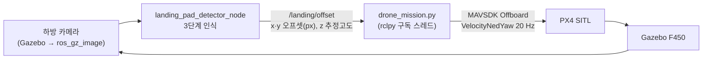

# F450 Vision-based Precision Landing

F450 드론과 로버(R1 / HBX 16889)가 협동하는 **농업 방역 미션**의 ROS 2 워크스페이스입니다. PX4 SITL과 Gazebo Harmonic 위에서 드론이 농경지를 방역한 뒤, 카메라로 **적색 패드 → 체커보드 → ArUco 마커**를 차례로 인식해 로버 위 착륙 패드에 정밀착륙합니다.

<p align="center">
<br>
<sub>왼쪽: 하방 카메라 인식 화면 (<code>/landing/debug_image</code>) · 오른쪽: Gazebo. 고도 10 m에서 ArUco 패드 중앙으로 정렬하며 하강</sub>
</p>

---

## 개발 과정

| 단계 | 기간 | 내용 | 영상 |
|---|---|---|---|
| 1. 시뮬레이션 환경 구축 | 2026.05 초 | PX4 SITL + Gazebo 농경지 월드(farmland A~D), R1 로버 키보드(WASD) 주행 | [01](docs/videos/01_rover_teleop_farmland.mp4) |
| 2. 드론·로버 멀티 SITL | 2026.05 말 | F450 모델 제작, MAVSDK Offboard 이동 테스트, 로버 이동 → 드론 방역(지그재그) → 복귀 미션 | [02](docs/videos/02_drone_offboard_test_farmland.mp4) |
| 3. 비전 기반 정밀착륙 | 2026.06 | 착륙 패드 3단계 인식 노드, ROS 2 ↔ MAVSDK 오프셋 연동, 속도 제어 착륙 | [03](docs/videos/03_precision_landing_attempt_1.mp4) · [04](docs/videos/04_precision_landing_attempt_2.mp4) · [05](docs/videos/05_precision_landing_PD.mp4) · [**06**](docs/videos/06_precision_landing_P_final.mp4) |

> 1~2단계는 [px4-drone-rover-sim](https://github.com/sjuaero/px4-drone-rover-sim)에서 진행한 초기 버전이며, 모델·월드·스크립트를 이 저장소로 통합했습니다. 당시의 방역 미션 스크립트는 [`scripts/spray_mission.py`](scripts/spray_mission.py)로 보존했습니다.

<p>


</p>
<p><sub>왼쪽부터: R1 로버 키보드 주행 · F450 Offboard 이동 테스트(전·후·좌·우) · PD 제어 정밀착륙 실험</sub></p>

전체 영상은 [`docs/videos/`](docs/videos)에 있습니다. GitHub 파일 화면에서 **View raw** 또는 다운로드로 재생할 수 있습니다.

---

## 정밀착륙 알고리즘



### 1) 착륙 패드 3단계 인식 (`landing_pad_detector_node.py`)

| 상태 | 전환 조건 | 인식 대상 | 고도 추정 |
|---|---|---|---|
| `RED_TRACK` | 적색 영역만 보일 때 (원거리) | HSV 적색 마스크 → 최대 컨투어 (1.0 m 패드) | 핀홀 모델 $h = W_\text{real} f_x / w_\text{px}$ |
| `CHECKER_APPROACH` | 체커보드 또는 ArUco 1~3개 | 적색 영역 안 체커보드 (0.6 m) | 체커보드 크기 기반 |
| `ARUCO_LAND` | ArUco **4개** 모두 인식 (근거리) | `DICT_4X4_50`, 12 cm 마커 × 4 | `estimatePoseSingleMarkers` 포즈 추정 |

- 카메라 내부 파라미터(캘리브레이션 값)로 거리를 추정합니다.
- 오프셋과 추정고도는 `/landing/offset`(`geometry_msgs/Point`)으로, 인식 단계는 `/landing/state`로 발행합니다.
- 디버그 영상(`/landing/debug_image`)에는 상태·고도·오프셋이 함께 표시됩니다.

### 2) 속도 제어 착륙 (`scripts/drone_mission.py`)

- **수평 속도**: 영상 중심과 타겟 중심의 픽셀 오프셋에 비례하는 P 제어입니다(게인 0.001, ±1.0 m/s 제한).
  - 카메라 +X(오른쪽)는 NED +East, +Y(아래)는 NED +North에 대응합니다.
- **하강 속도**: 기본값은 고도 3 m 이상에서 0.4 m/s, 이하에서 0.15 m/s입니다.
  - 여기에 정렬 계수 $\max(0,\,1 - d_\text{px}/80)$을 곱해, 정렬이 잘될수록 빠르게 내려가고 80 px 이상 벗어나면 하강을 멈춥니다.
- **착지**: 고도 0.5 m 이하에서 Offboard를 끝내고 `land()`로 마무리합니다.
- 오프셋이 들어오지 않으면 제자리 호버링합니다.

| 디버깅 이력 | 내용 |
|---|---|
| 부호 반전 제거 | 오프셋을 한 번 더 반전해 타겟에서 멀어지는 **양성 피드백(발산)**이 생기던 문제를 수정 |
| 하강·정렬 결합 | 정렬 오차가 클수록 하강 속도를 연속적으로 줄여, 수평 정렬을 먼저 맞춘 뒤 내려가도록 변경 |
| PD 제어 실험 | 미분항을 추가한 버전을 시험한 뒤([05](docs/videos/05_precision_landing_PD.mp4)) 최종적으로 P 제어 + 하강 결합 방식을 채택([06](docs/videos/06_precision_landing_P_final.mp4)) |

---

## 구조

```
ros2_ws/src/
  f450_description/   # F450 드론 URDF, 메시, launch, 착륙 월드/모델
  agri_mission/        # 미션 패키지 모음
    agri_aruco_detector/    # ArUco 인식 + 착륙패드 감지(landing_pad_detector_node)
    agri_drone_controller/  # 드론 제어(MAVROS), 방역 패턴 실행
    agri_rover_controller/  # 로버 제어(Nav2)
    agri_mission_manager/   # 미션 상태 관리
    agri_llm_interface/     # LLM 기반 미션 명령 해석
    agri_bringup/            # 통합 launch, rviz, config
    agri_gazebo/              # Gazebo 월드/모델
    agri_interfaces/          # msg/srv/action 정의

scripts/                # mavsdk 기반 미션 스크립트
  drone_mission.py        # 비전 연동 정밀착륙 (최종)
  spray_mission.py        # 농경지 지그재그 방역 → 로버 복귀 → 착륙 (초기 버전)
  full_mission.py         # 로버 이동 → 정지 → 드론 이륙·방역·복귀·착륙 통합 미션
  drone_control.py        # Offboard 기본 이동 테스트
  rover_move.py / rover_turn.py / rover_diag.py   # 로버 직진·선회·진단

px4_overlay/            # PX4-Autopilot(업스트림) 위에 추가/수정해야 하는 파일들
  run_*.sh, multi_sitl.sh        # PX4-Autopilot 루트에 복사
  airframes/                      # ROMFS/px4fmu_common/init.d-posix/airframes/ 에 복사
  patches/airframes_and_mavlink.patch  # airframes/CMakeLists.txt, px4-rc.mavlink 에 적용
  gz_models_worlds/              # Tools/simulation/gz (PX4-gazebo-models 서브모듈)의 models/, worlds/ 에 복사
                                  # r1_rover_overlay/ 는 기존 r1_rover 모델에 추가/교체할 파일

docs/
  images/               # README GIF
  videos/               # 개발 단계별 시뮬레이션 영상 (01~06)
```

### Gazebo 모델·월드

| 종류 | 이름 | 설명 |
|---|---|---|
| 드론 | `f450` | F450 기체·프로펠러 메시, 하방 카메라 |
| 로버 | `r1_rover_clean`, `r1_rover_aruco`, `r1_rover_overlay` | PX4 R1 로버에 상판(착륙 패드·ArUco) 추가 |
| 로버 | `hbx16889_rover`, `my_rover` | HBX 16889 RC 트럭 기반 로버 (URDF 변환) |
| 로버 | `rover_differential_aruco` | 차동구동 로버 + ArUco |
| 월드 | `farmland.sdf` | 농경지 A~D, 도로, 표지판 |
| 월드 | `kimje_farmland.sdf`, `kimje_satellite.sdf` | 김제 농지 월드 (`kimje_satellite`는 위성 사진·노멀맵 텍스처 적용) |
| 월드 | `rice_field.sdf` | 논 월드 (차동구동 ArUco 로버 포함) |
| 월드 | `f450_landing.sdf`, `aruco_rover.sdf` | 정밀착륙 시험용 |

## 환경 요구사항

- Ubuntu 24.04 (WSL2)
- [PX4-Autopilot](https://github.com/PX4/PX4-Autopilot) 빌드 완료 (`~/PX4-Autopilot`)
- ROS2 Jazzy, Gazebo Harmonic
- Python 3 + mavsdk, opencv-contrib-python(aruco)

## 설치

1. `px4_overlay/` 내용을 안내대로 `~/PX4-Autopilot` 트리에 복사하고 `patches/airframes_and_mavlink.patch` 적용
2. `ros2_ws/src/` 를 자신의 ROS2 워크스페이스 `src/` 에 복사 후 `colcon build`
3. `scripts/` 를 `~/scripts` 로 복사

## 실행

### 정밀착륙 (터미널 4개)

```bash
# 1. PX4 SITL + Gazebo (착륙 미션용)
~/PX4-Autopilot/run_drone_landing.sh

# 2. uXRCE-DDS 브리지
MicroXRCEAgent udp4 -p 8888

# 3. 카메라 브리지 + 착륙패드 인식
ros2 launch f450_description f450_px4_bridge.launch.py
# 자동으로 뜨는 rqt_image_view 창에서 토픽을 /landing/debug_image 로 선택

# 4. 착륙 미션 제어
python3 ~/scripts/drone_mission.py
```

### 농경지 방역 미션 (드론 + 로버)

```bash
# 1. 로버 실행 (Gazebo 농경지 월드 포함)
~/PX4-Autopilot/run_rover_farmland.sh

# 2. 드론 실행
~/PX4-Autopilot/run_drone_farmland.sh

# 3. 방역 미션 (EKF2 수렴 후 실행)
python3 ~/scripts/spray_mission.py    # 또는 로버 이동까지 포함한 full_mission.py
```

`spray_mission.py` 상단에서 대상 농경지(`TARGET_FARM` A~D), 방역 고도(`SPRAY_ALT`), 살포 줄 간격(`LINE_SPACING`)을 바꿀 수 있습니다. 지그재그 비행 경로를 설계할 때는 드론 반경의 1.5배를 여유로 두세요.

## 관련 프로젝트

- [F450-Autopilot-simulation](https://github.com/sjuaero/F450-Autopilot-simulation): 같은 F450 기체의 Simulink 동역학 모델링과 자동비행 제어기
