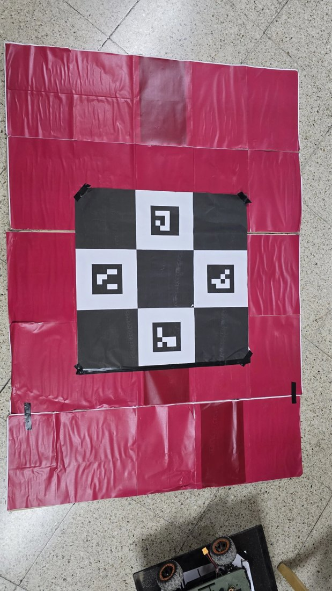
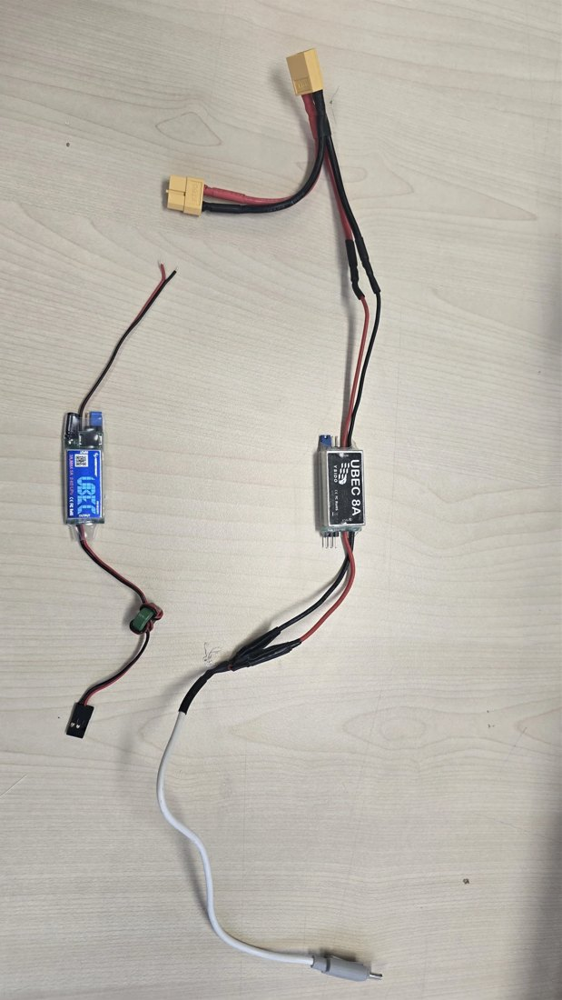
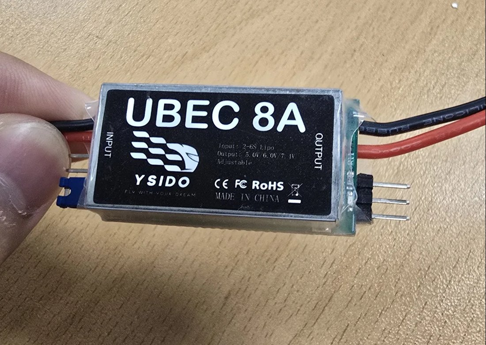
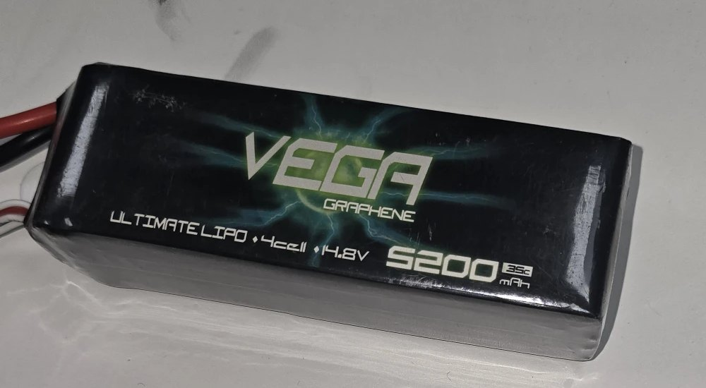
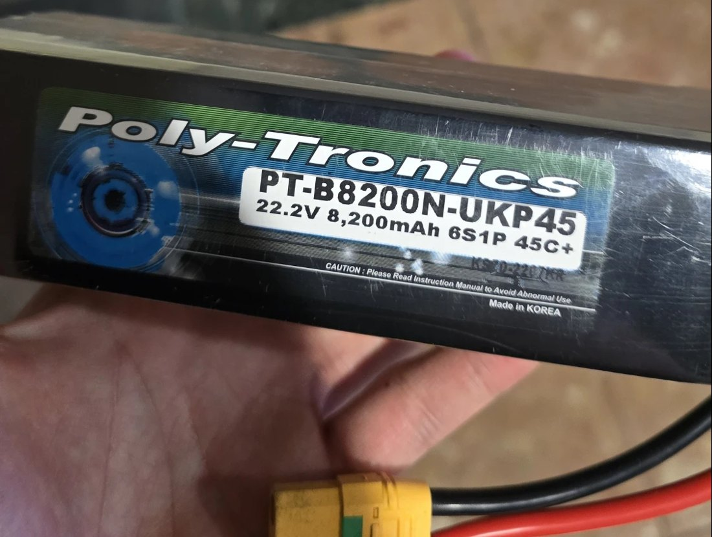

# 실기체 하드웨어

실환경 검증에 사용한 착륙 패드와 전원 부품 사진입니다.

[← README로 돌아가기](../README.md)

## 구성

| 구분 | 부품 |
|---|---|
| 기체 | F450 프레임 (대각선 450 mm, 중심~모터 225 mm) |
| 구동계 | 2212 920KV 모터 × 4, 10인치 프로펠러 |
| 비행 컨트롤러 | Pixhawk 6C (PX4) |
| 컴패니언 컴퓨터 | Raspberry Pi 5 |
| 카메라 | 하방 USB 카메라 |
| 로버 | HBX 16889 |

Pixhawk 6C에서 쓰는 포트는 다음과 같습니다.

| 포트 | 연결 |
|---|---|
| `POWER1` | 파워 모듈 (메인 전원) |
| `GPS1` | GPS, 나침반, 안전 스위치 |
| `TELEM1` | 지상국과의 무선 텔레메트리 |
| `TELEM2` | 컴패니언 컴퓨터 (Raspberry Pi 5) |

## 착륙 패드

적색 패드 가운데에 체커보드를 두고, 흰 칸 4곳에 ArUco 마커(ID 0~3)를 배치했습니다. 시뮬레이션의 패드와 같은 구성입니다. 사진 아래쪽에 보이는 것이 로버입니다.

- 멀리서는 넓은 적색 영역이 먼저 잡히고, 가까워지면 체커보드와 ArUco가 보입니다.
- 실제 패드의 크기는 약 1.5 m × 1.05 m입니다.

## 전원

<table>
<tr>
<td width="34%"></td>
<td width="66%">

</td>
</tr>
<tr>
<td>XT60 분기 케이블 → UBEC → USB-C 케이블</td>
<td>UBEC 8A (입력 2~6S LiPo, 출력 5.0 / 6.0 / 7.4 V 선택)</td>
</tr>
</table>

배터리 전압을 UBEC로 5 V로 낮춘 뒤 USB-C로 컴패니언 컴퓨터에 공급합니다. XT60을 둘로 나눠 기체 전원과 같은 배터리를 씁니다.

<table>
<tr>
<td width="50%"></td>
<td width="50%"></td>
</tr>
<tr>
<td>4S 14.8 V 5200 mAh LiPo</td>
<td>6S 22.2 V 8200 mAh LiPo</td>
</tr>
</table>
