# 시뮬레이션 구축 과정

팀 발표 자료에서 로버·드론 모델 제작과 Gazebo 환경 구축 부분을 정리한 문서입니다. 그림 속 수치는 발표 시점의 값이며, 최종 값은 저장소의 모델 파일을 기준으로 합니다.

[← README로 돌아가기](../README.md)

## 1. 시뮬레이션을 먼저 만든 이유

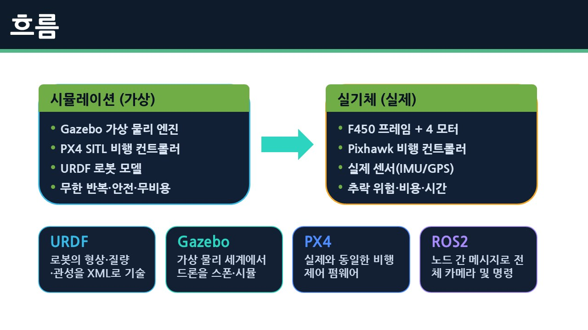

정밀착륙 제어를 시험하려면 드론의 형상과 물성치가 실제와 가까워야 물리적 거동을 믿을 수 있습니다. 그래서 다음 네 가지를 묶어 환경을 만들었습니다.

| 구성 | 역할 |
|---|---|
| URDF / SDF | 로봇의 형상, 질량, 관성을 XML로 기술 |
| Gazebo | 가상 물리 세계에서 모델을 스폰하고 시뮬레이션 |
| PX4 SITL | 실제와 같은 비행 제어 펌웨어 |
| ROS 2 | 노드 사이의 메시지로 카메라 영상과 명령 전달 |

순서는 이미 구현된 로버부터 만들고, 그다음 드론을 진행했습니다.

## 2. 로버 모델 (HBX 16889)

대상은 HBX 16889 RAVAGE Brushless입니다. 4WD 샤프트 구동, 아커만 조향, 더블 위시본 서스펜션 구조인데, 상용 제품이라 부품별 CAD 파일이 공개되어 있지 않습니다. 그래서 두 가지 방법을 섞었습니다.

- **형상을 알 수 없는 부품**: 박스, 실린더 같은 기본 도형(primitive geometry)으로 대체하고, 도형의 질량관성모멘트 공식을 적용합니다.
- **형상을 아는 부품**: CAD에서 부피와 관성모멘트를 구해 반영합니다.

### 2.1 CAD로 물성치 구하기

질량을 아는 부품은 CAD에서 부피를 구해 밀도를 역산합니다. 예를 들어 M10 GPS는 제조사 사양의 질량이 36.8 g입니다.

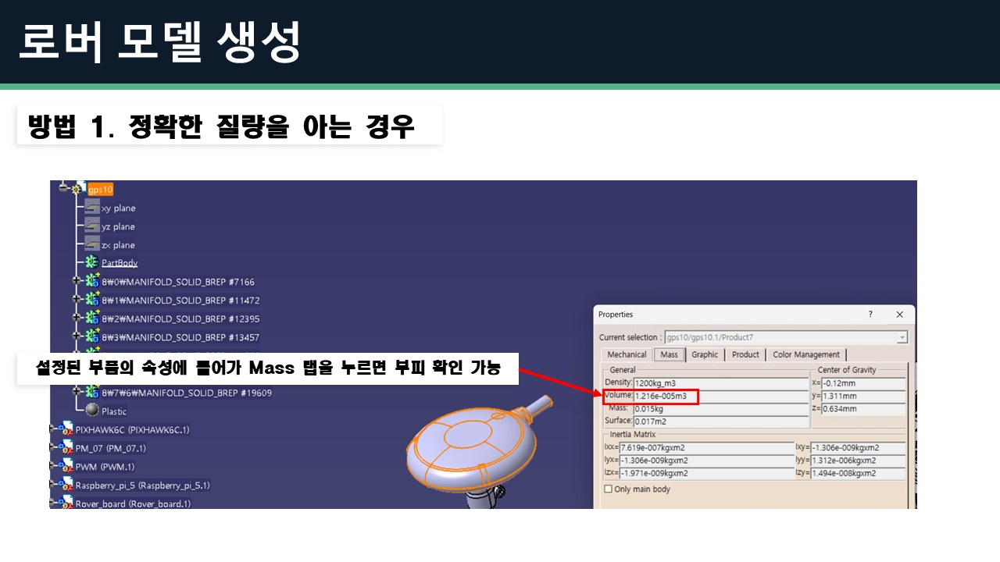

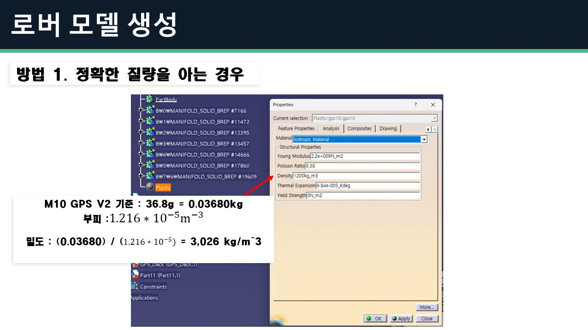

$$
\rho = \frac{m}{V} = \frac{0.03680\ \text{kg}}{1.216 \times 10^{-5}\ \text{m}^3} \approx 3{,}026\ \text{kg/m}^3
$$

이 밀도를 CAD의 재질 속성에 넣으면 무게중심과 관성모멘트가 계산됩니다. 질량을 모르는 부품은 저울로 재거나, 3D 프린팅 부품은 슬라이서가 계산한 필라멘트 무게를 썼습니다.

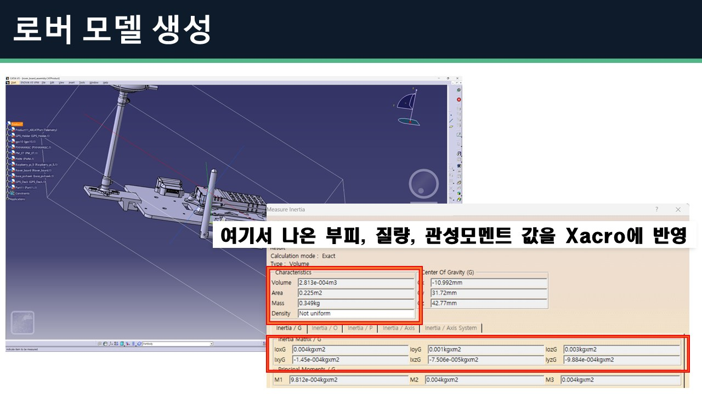

### 2.2 Xacro → URDF → RViz

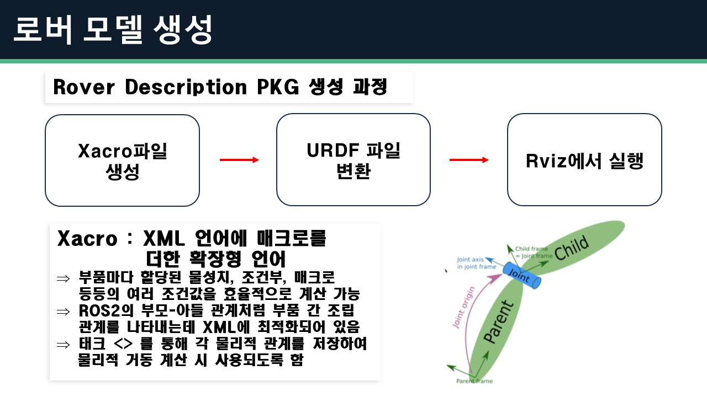

Xacro는 XML에 매크로를 더한 확장 언어입니다. 부품마다 반복되는 물성치 계산을 매크로로 묶을 수 있고, 링크와 조인트의 부모-자식 관계를 표현하기 좋습니다.

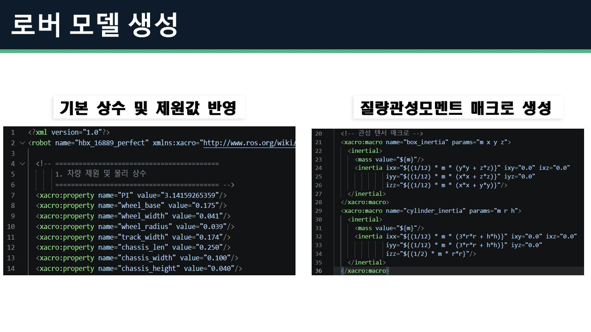

차량 제원을 상수로 정의하고, 박스와 실린더의 관성모멘트 공식을 매크로로 만들어 각 링크에서 호출합니다.

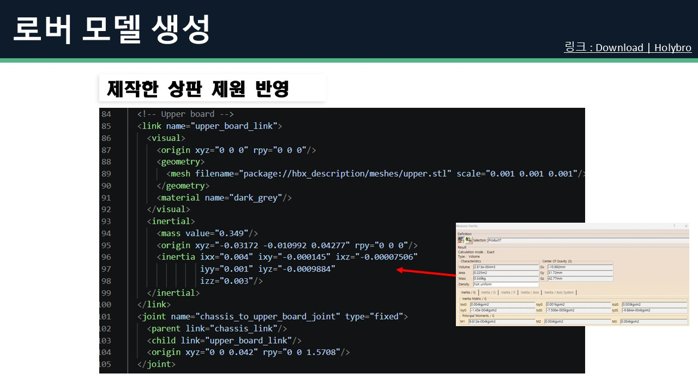

직접 제작한 상판은 CAD에서 구한 질량, 무게중심, 관성 텐서를 그대로 넣었습니다.

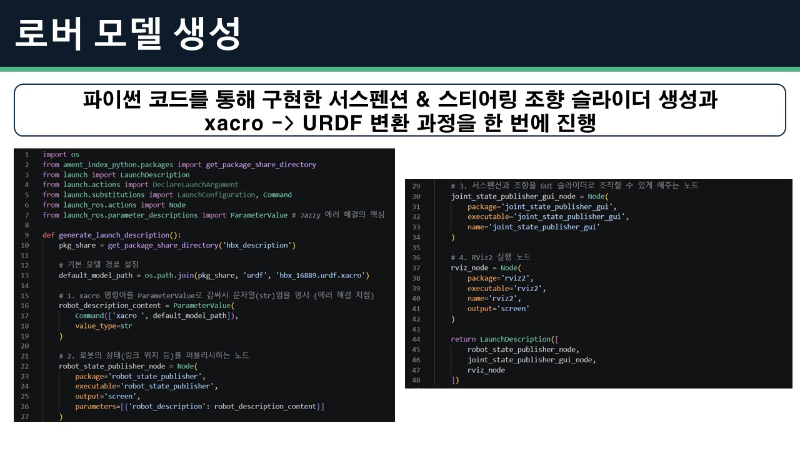

launch 파일 하나로 Xacro → URDF 변환, `robot_state_publisher`, 조향·서스펜션을 움직여 보는 `joint_state_publisher_gui`, RViz를 한 번에 실행합니다.

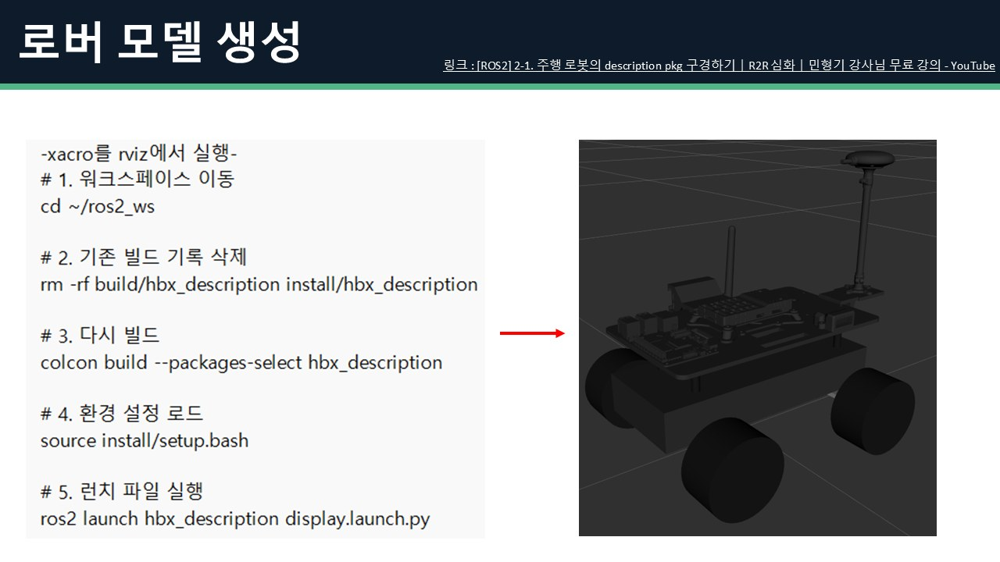

```bash
cd ~/ros2_ws
colcon build --packages-select hbx_description
source install/setup.bash
ros2 launch hbx_description display.launch.py
```

### 2.3 URDF → SDF → Gazebo

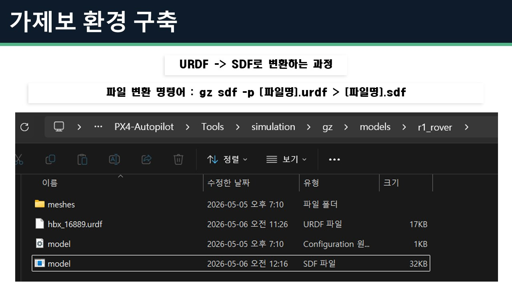

Gazebo는 SDF를 쓰므로 URDF를 변환해 PX4의 모델 폴더에 넣습니다.

```bash
gz sdf -p hbx_16889.urdf > model.sdf
```

```bash
cd ~/PX4-Autopilot
pkill -f px4; pkill -f gz; sleep 2
PX4_GZ_WORLD=farmland make px4_sitl gz_r1_rover
```

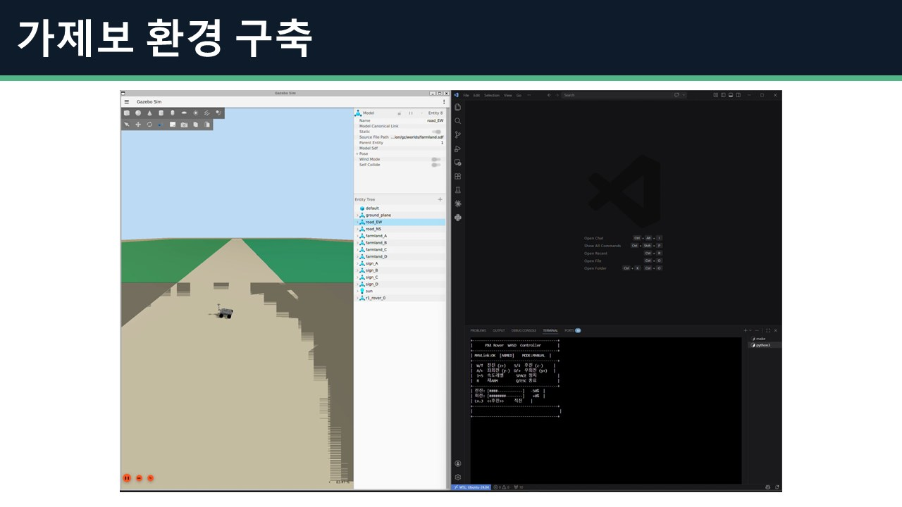

## 3. F450 드론 모델

### 3.1 좌표계

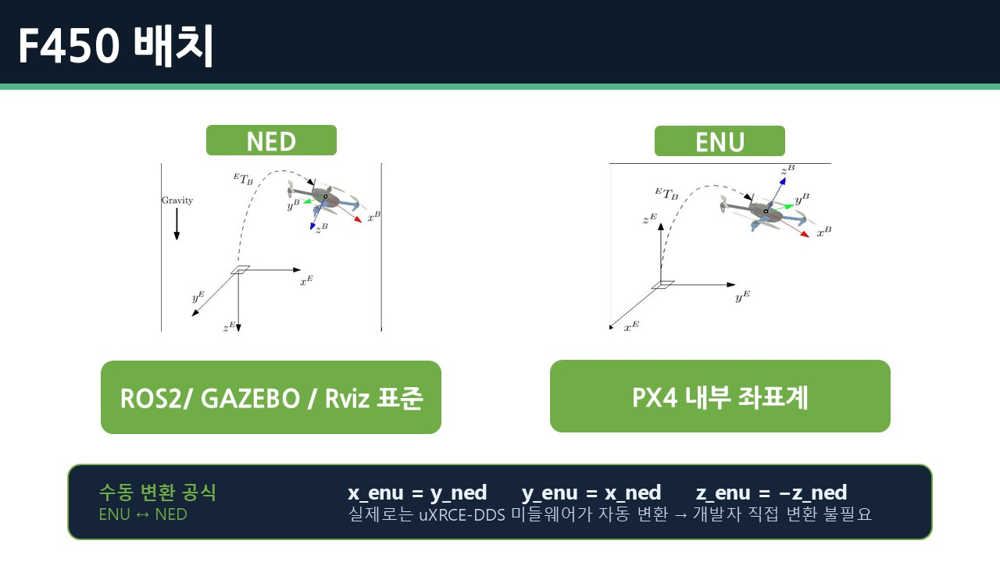

ROS 2, Gazebo, RViz는 ENU를, PX4 내부는 NED를 씁니다.

$$
x_\text{enu} = y_\text{ned}, \qquad y_\text{enu} = x_\text{ned}, \qquad z_\text{enu} = -z_\text{ned}
$$

uXRCE-DDS 미들웨어가 변환을 처리하지만, 카메라 오프셋을 속도 명령으로 바꿀 때는 축 방향을 직접 맞춰야 합니다. 정밀착륙 초기에 드론이 타겟에서 멀어지던 문제가 이 부호에서 나왔습니다.

### 3.2 추력 계수와 토크 계수

Gazebo의 모터 모델은 모터 각속도 $\omega$에서 추력과 반토크를 계산합니다.

$$
T = b\,\omega^2, \qquad Q = d\,\omega^2
$$

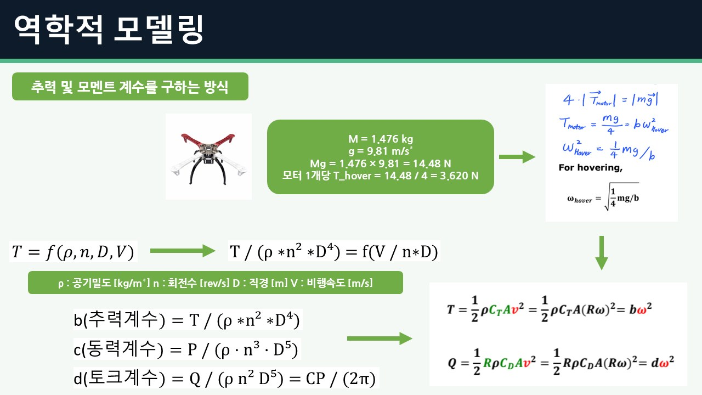

프로펠러의 무차원 계수로 쓰면 다음과 같습니다. ($\rho$: 공기 밀도, $n$: 회전수 [rev/s], $D$: 직경)

$$
C_T = \frac{T}{\rho\, n^2 D^4}, \qquad C_P = \frac{P}{\rho\, n^3 D^5}, \qquad C_Q = \frac{Q}{\rho\, n^2 D^5} = \frac{C_P}{2\pi}
$$

$\omega = 2\pi n$이므로 계수는 이렇게 연결됩니다.

$$
b = \frac{C_T\, \rho\, D^4}{4\pi^2}, \qquad d = \frac{C_Q\, \rho\, D^5}{4\pi^2}
$$

호버링에서는 모터 4개의 추력이 무게와 같습니다. 기체 질량 1.476 kg이면 $mg = 14.48$ N, 모터 하나당 3.62 N입니다.

$$
\omega_\text{hover} = \sqrt{\frac{mg}{4b}}
$$

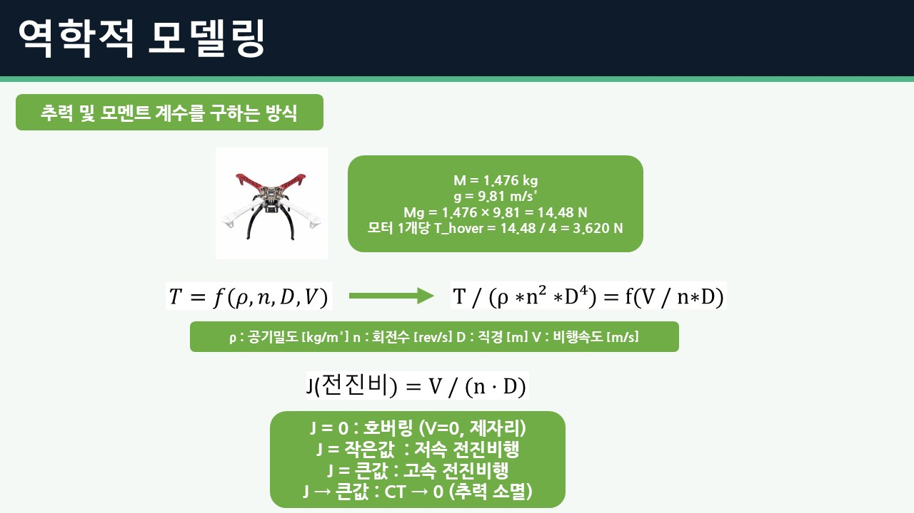

$C_T$는 전진비 $J = V/(nD)$에 따라 달라집니다. 호버링은 $J = 0$에 해당합니다.

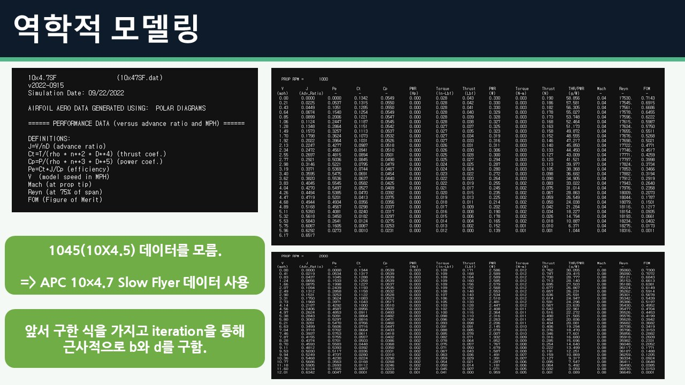

사용한 1045(10 × 4.5) 프로펠러의 데이터가 없어, 비슷한 APC 10 × 4.7 Slow Flyer의 공개 성능 데이터를 썼습니다.

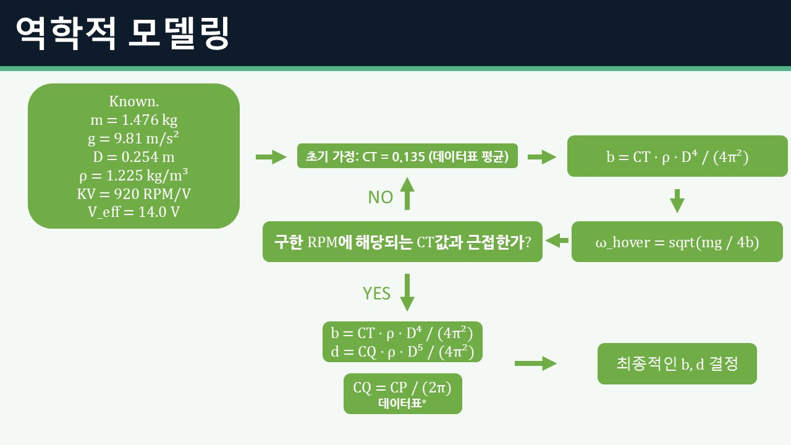

$C_T$는 회전수에 따라 조금씩 바뀌므로 반복 계산으로 정했습니다.

1. $C_T$의 초기값을 데이터표 평균(0.135)으로 가정합니다.
2. $b$를 계산하고 $\omega_\text{hover}$를 구합니다.
3. 그 회전수에서의 데이터표 $C_T$와 가정한 값이 가까운지 확인합니다.
4. 다르면 값을 바꿔 다시 계산하고, 가까우면 $b$와 $d$를 확정합니다.

### 3.3 CAD 모델 → SDF

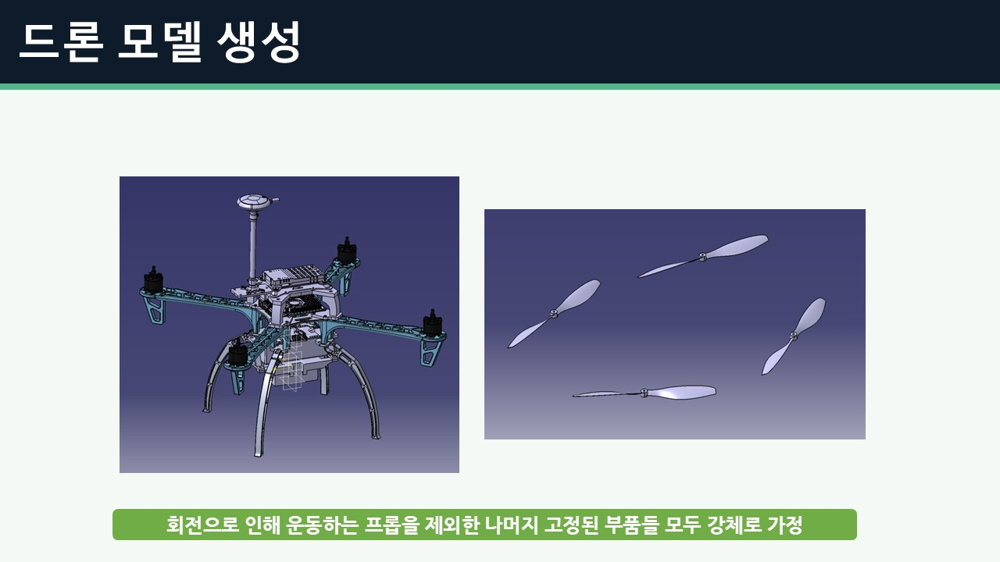

회전하는 프로펠러를 뺀 나머지 고정 부품은 하나의 강체로 가정했습니다.

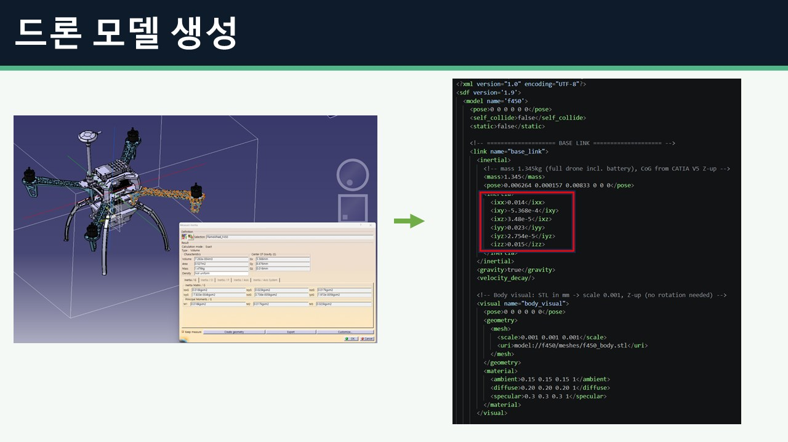

CATIA에서 구한 질량, 무게중심, 관성 텐서를 `base_link`의 `<inertial>`에 넣고, 형상은 STL 메시로 불러옵니다.

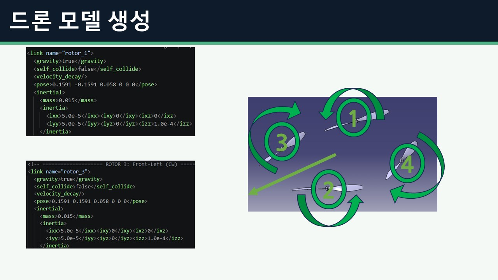

로터 4개는 중심에서 ±159 mm 위치에 두고, 마주 보는 로터끼리 같은 방향(CW/CCW)으로 회전하게 했습니다.

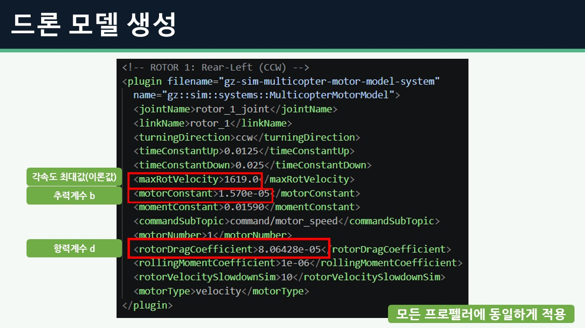

3.2절에서 구한 값이 `MulticopterMotorModel` 플러그인에 들어갑니다.

| SDF 항목 | 의미 |
|---|---|
| `maxRotVelocity` | 모터 최대 각속도 (이론값) |
| `motorConstant` | 추력 계수 $b$ |
| `momentConstant` | 추력 대비 반토크 비율 |
| `rotorDragCoefficient` | 로터 항력 계수 |

최종 모델은 [`px4_overlay/gz_models_worlds/models/f450/model.sdf`](../px4_overlay/gz_models_worlds/models/f450/model.sdf)에 있습니다. 발표 이후 값을 다시 조정했기 때문에 그림 속 수치와 파일의 수치는 다릅니다.
