# 비전 기반 정밀착륙 알고리즘

팀 발표 자료에서 정밀착륙과 카메라 부분을 정리한 문서입니다. 그림 속 수치는 발표 시점의 값이고, 저장소 코드의 최종 값과 다른 부분은 본문에 따로 적었습니다.

[← README로 돌아가기](../README.md)

## 1. 왜 비전 기반 정밀착륙인가

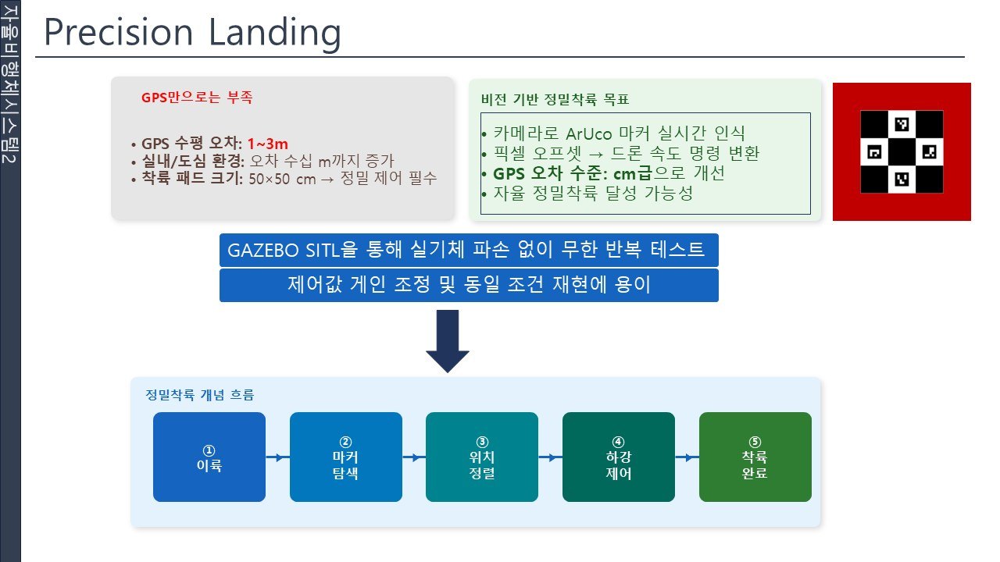

- GPS의 수평 오차는 1~3 m 수준이고, 실내나 도심에서는 더 커집니다. 로버 위의 작은 착륙 패드에 내리기에는 부족합니다.
- 카메라로 착륙 패드를 실시간으로 인식하고, 영상에서 구한 픽셀 오프셋을 드론의 속도 명령으로 바꿔 오차를 줄입니다.
- 전체 흐름은 **이륙 → 마커 탐색 → 위치 정렬 → 하강 제어 → 착륙 완료**입니다.
- Gazebo SITL에서 먼저 개발했습니다. 실기체를 부수지 않고 반복 시험할 수 있고, 같은 조건을 재현하면서 제어 게인을 조정할 수 있기 때문입니다.

## 2. 3단계 비전 상태머신

거리에 따라 잘 보이는 대상이 다르므로 인식 대상을 단계적으로 바꿉니다.

| 단계 | 거리 | 인식 대상 | 방법 |
|---|---|---|---|
| `RED_TRACK` | 원거리 | 적색 패드 | HSV 색상 마스크 → 최대 컨투어 |
| `CHECKER_APPROACH` | 중거리 | 체커보드 | 적색 영역 안의 체커보드 패턴 |
| `ARUCO_LAND` | 근거리 | ArUco 마커 4개 | `DICT_4X4_50` 마커 검출과 포즈 추정 |

구현은 [`landing_pad_detector_node.py`](../ros2_ws/src/agri_mission/agri_aruco_detector)에 있습니다.

## 3. 전체 제어 흐름

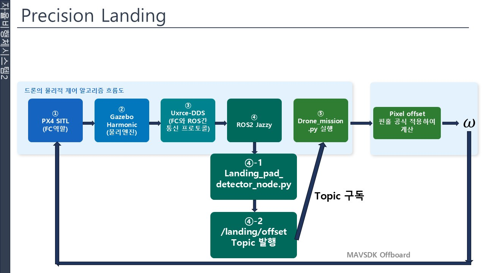

1. **PX4 SITL**이 비행 컨트롤러(FC) 역할을 합니다.
2. **Gazebo Harmonic**이 물리 엔진으로 기체와 카메라를 시뮬레이션합니다.
3. **uXRCE-DDS**가 FC와 ROS 2 사이의 통신을 맡습니다.
4. **ROS 2 Jazzy**에서 `landing_pad_detector_node.py`가 카메라 영상을 받아 `/landing/offset` 토픽을 발행합니다.
5. `drone_mission.py`가 이 토픽을 구독해 픽셀 오프셋을 속도 명령으로 바꾸고, **MAVSDK Offboard**로 PX4에 보냅니다.

기체가 움직이면 카메라 영상이 바뀌고, 다시 오프셋이 계산되는 폐루프입니다.

## 4. 픽셀 오프셋 → 속도 명령

**핀홀 카메라 모델**

$$
\begin{pmatrix} u \\ v \\ 1 \end{pmatrix}
= \frac{1}{Z}
\begin{pmatrix} f_x & 0 & c_x \\ 0 & f_y & c_y \\ 0 & 0 & 1 \end{pmatrix}
\begin{pmatrix} X \\ Y \\ Z \end{pmatrix}
$$

- $u, v$: 이미지 픽셀 좌표
- $f_x, f_y$: 초점거리(픽셀 단위)
- $c_x, c_y$: 주점(이미지 중심)
- $X, Y, Z$: 카메라 좌표계에서의 3D 위치

**픽셀 오프셋**은 마커 중심과 이미지 중심의 차이입니다.

$$
\text{offset}_x = u_\text{marker} - c_x, \qquad \text{offset}_y = v_\text{marker} - c_y
$$

**실제 거리(m)** 로 바꾸면 다음과 같습니다.

$$
X = \frac{\text{offset}_x \cdot Z}{f_x}, \qquad Y = \frac{\text{offset}_y \cdot Z}{f_y}
$$

**기체 좌표계 속도**는 오프셋에 게인을 곱한 P 제어입니다.

$$
v_\text{forward} = -\,\text{offset}_y \times \text{gain}, \qquad v_\text{right} = +\,\text{offset}_x \times \text{gain}
$$

**NED 변환**은 기체의 요(yaw) 각 $\psi$로 회전시킵니다.

$$
\begin{pmatrix} v_N \\ v_E \end{pmatrix}
=
\begin{pmatrix} \cos\psi & -\sin\psi \\ \sin\psi & \cos\psi \end{pmatrix}
\begin{pmatrix} v_\text{fwd} \\ v_\text{right} \end{pmatrix}
$$

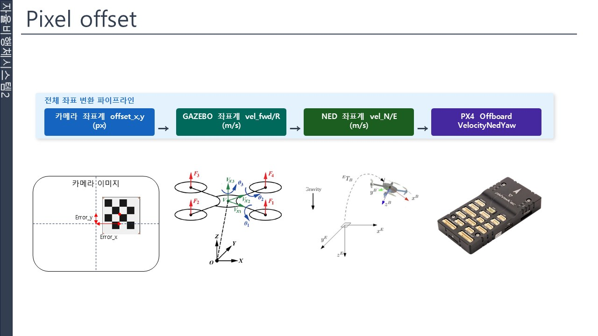

카메라 좌표계의 오프셋(px) → 기체 좌표계 속도(m/s) → NED 속도(m/s) → PX4 Offboard `VelocityNedYaw` 순서로 전달됩니다.

> 저장소의 [`scripts/drone_mission.py`](../scripts/drone_mission.py)는 게인 0.001, 수평 속도 제한 ±1.0 m/s를 쓰고, 카메라 +X를 NED +East, +Y를 NED +North로 바로 대응시킵니다.

## 5. 정렬 기반 하강과 고도 계산

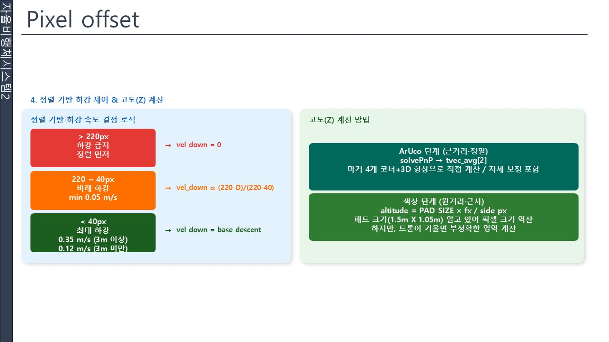

**하강 속도**는 수평 정렬이 얼마나 맞았는지에 따라 정합니다. 정렬이 안 된 상태로 내려가면 패드가 시야에서 벗어나기 때문입니다.

| 구분 | 발표 시점 (그림) | 저장소 최종 코드 |
|---|---|---|
| 하강 금지 | 오프셋 220 px 초과 | 오프셋 80 px 이상 |
| 비례 하강 | 220~40 px 구간에서 선형 | 정렬 계수 $\max(0,\,1 - d_\text{px}/80)$ 을 곱함 |
| 기본 하강 속도 | 3 m 이상 0.35 m/s, 미만 0.12 m/s | 3 m 초과 0.4 m/s, 이하 0.15 m/s |

**고도(Z) 계산**은 단계에 따라 다릅니다.

- **ArUco 단계 (근거리, 정밀)**: 마커 4개의 코너와 알려진 3D 형상으로 포즈를 풀어 거리를 직접 구합니다. 자세 보정이 포함됩니다.
- **색상 단계 (원거리, 근사)**: 패드의 실제 크기를 알고 있으므로 영상에서의 픽셀 크기로 역산합니다.

$$
\text{altitude} = \frac{\text{PAD SIZE} \times f_x}{\text{side}_\text{px}}
$$

색상 단계는 드론이 기울면 패드 영역이 찌그러져 보여 부정확해지는 한계가 있습니다.

## 6. 카메라 캘리브레이션

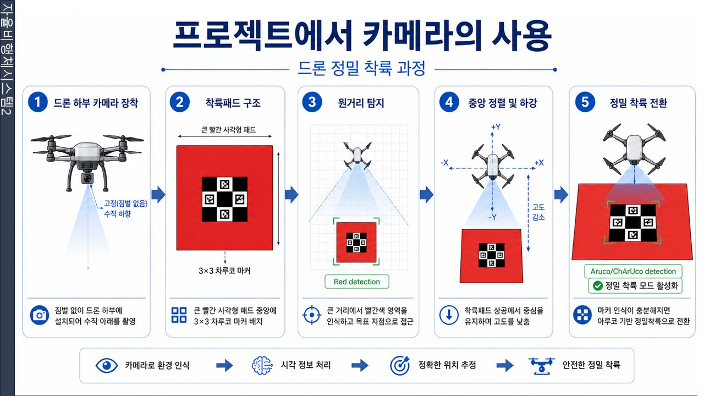

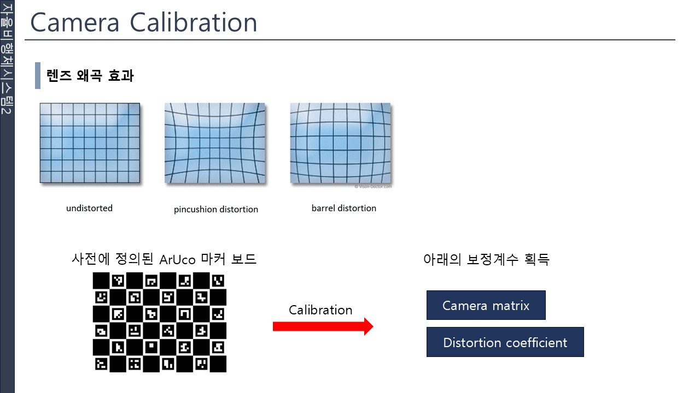

- **렌즈 왜곡**: 사전에 정의된 ArUco 마커 보드를 촬영해 카메라 행렬(camera matrix)과 왜곡 계수(distortion coefficient)를 구합니다. 4절의 $f_x, f_y, c_x, c_y$가 여기서 나옵니다.
- **색상**: 같은 적색 패드도 조명에 따라 다르게 찍히므로 노출, 화이트 밸런스, 밝기, 대비, 채도를 환경에 맞게 조절해야 합니다.

### 캘리브레이션 GUI

테스트와 수정을 반복할 때마다 코드의 변수 값을 바꾸는 것이 번거로워, 값을 화면에서 조절하는 프로그램을 팀에서 만들었습니다.

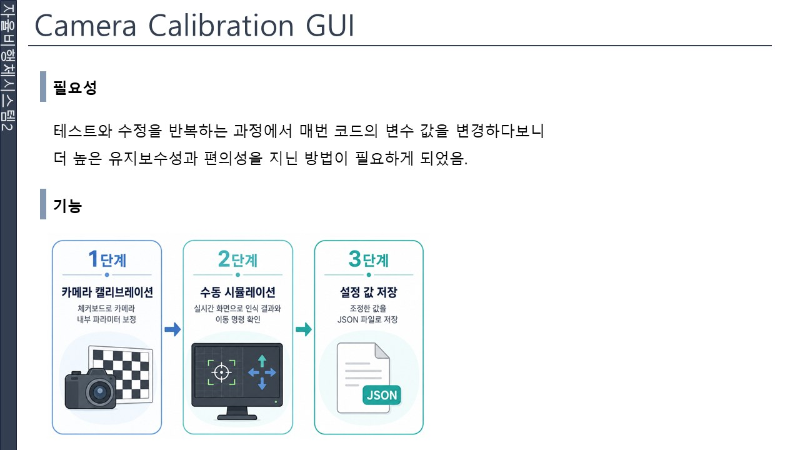

| 기능 | 내용 |
|---|---|
| 카메라 캘리브레이션 | 보드로 카메라 내부 파라미터 보정 |
| 적색 영역 검출 | 검출된 사각형과 중앙까지의 거리, 적색으로 판단된 마스크를 함께 표시 |
| ArUco 마커 검출 | 검출된 마커와 마커 중앙 표시 |
| 수동 시뮬레이션 | 카메라를 손으로 움직이며 정렬 상태와 제어 명령 확인 |
| 저장 | 조정한 값을 JSON 파일로 저장 |

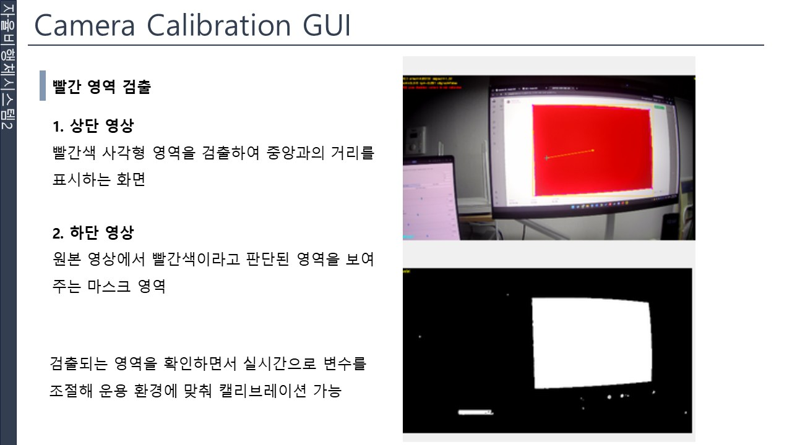

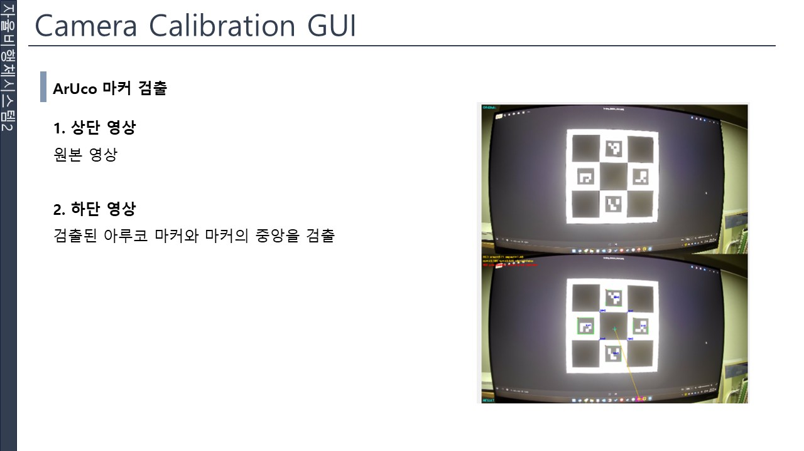

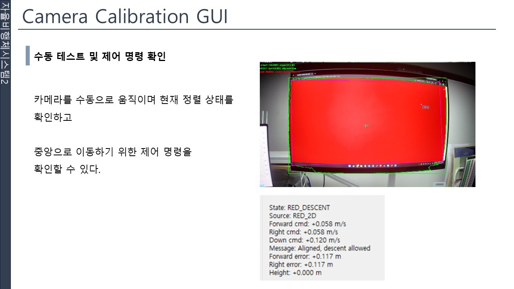

수동 테스트 화면에서는 현재 상태(`RED_DESCENT` 등), 전·후/좌·우/하강 명령값, 정렬 오차를 실시간으로 볼 수 있습니다. 기체를 띄우지 않고도 제어 명령의 부호와 크기가 맞는지 확인할 수 있습니다.

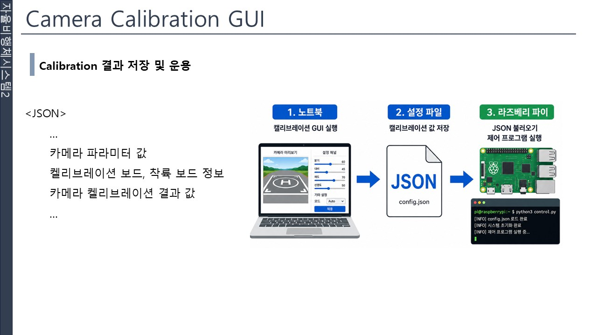

노트북에서 GUI로 조정한 값을 JSON으로 저장하고, 라즈베리파이에서 그 JSON을 불러 제어 프로그램을 실행합니다.

## 7. 초기 인식 시험

착륙 패드를 확정하기 전에 실제 카메라로 한 시험입니다.

**단일 ArUco 마커 거리 측정**

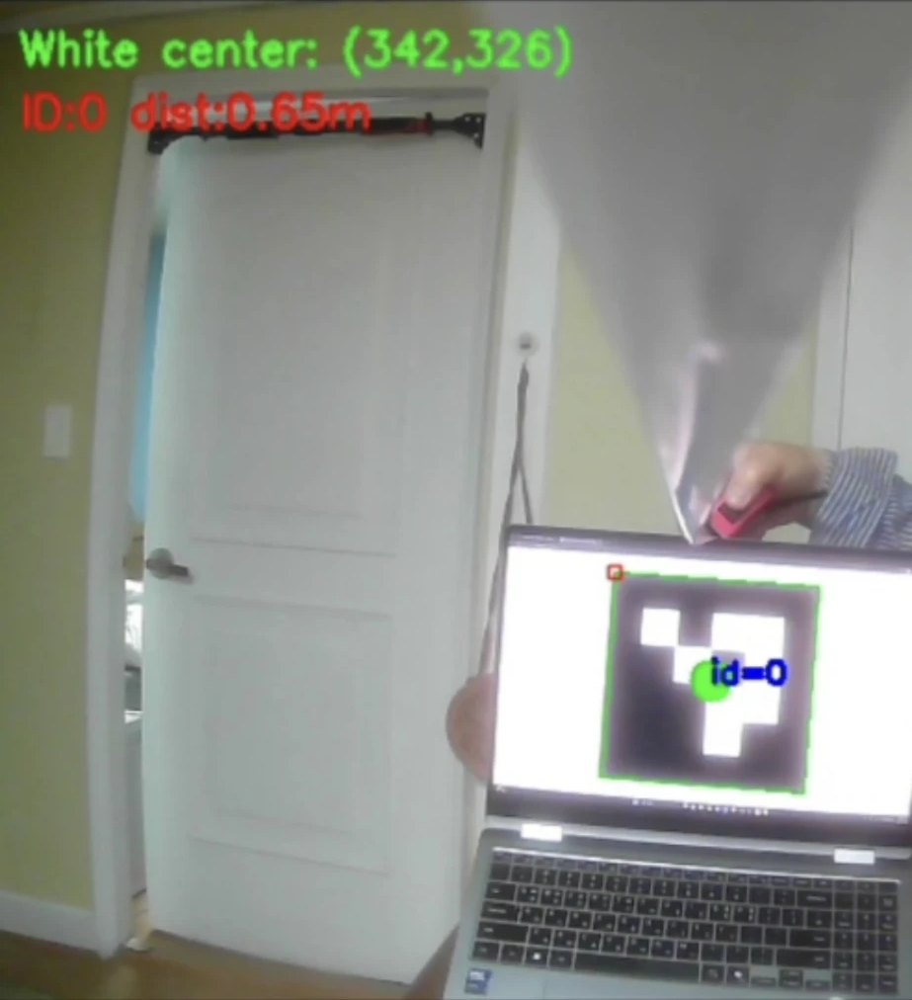

| 실측 거리 | 마커 크기 | 카메라가 추정한 거리 |
|---|---|---|
| 30 cm | 100 × 100 mm | 56 cm |
| 30 cm | **200 × 200 mm** | **30 cm** |
| 30 cm | 300 × 300 mm | 20 cm |
| 100 cm | 100 × 100 mm | 200 cm |
| 100 cm | **200 × 200 mm** | **98~100 cm** |
| 100 cm | 300 × 300 mm | 64~65 cm |

코드에 설정한 마커 크기와 실제 마커 크기가 맞을 때만 거리가 맞게 나옵니다. 마커 크기 설정과 캘리브레이션의 중요성을 확인한 시험입니다.

**색 영역 + ArUco 4개 인식**

<table>
<tr>
<td>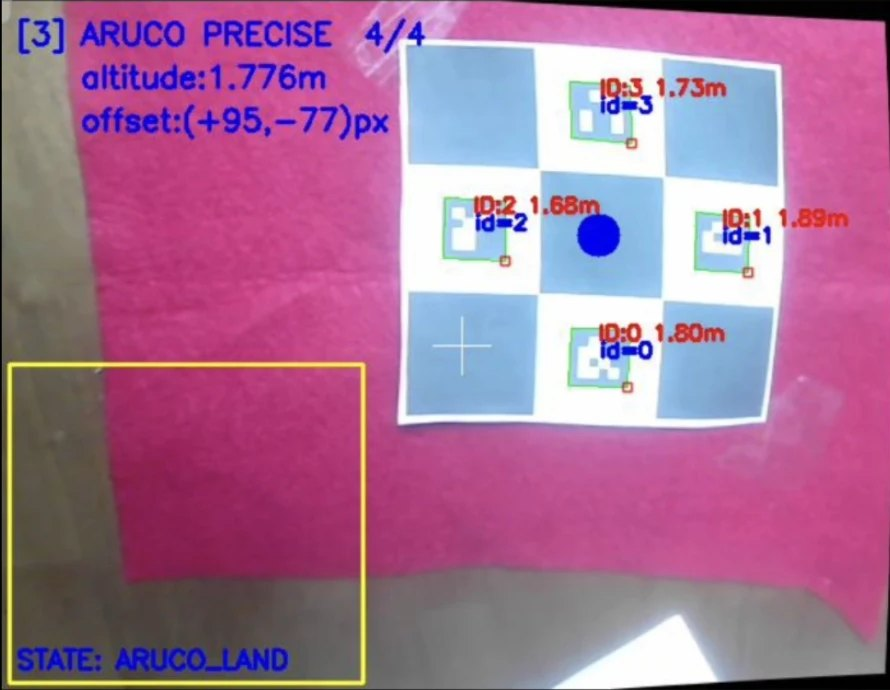</td>
<td>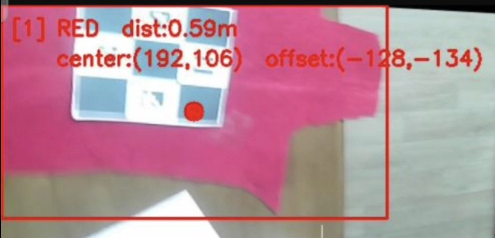</td>
</tr>
<tr>
<td><code>ARUCO PRECISE 4/4</code>: 마커 4개를 모두 인식해 고도와 오프셋을 계산</td>
<td><code>RED</code>: 적색 영역만으로 거리와 오프셋을 계산</td>
</tr>
</table>

HSV로 적색을 잡을 때 갈색 바닥의 채도(S)가 비슷해 잘 구별되지 않는 문제가 있었습니다. 이 때문에 패드 색과 HSV 임계값을 운용 환경에 맞춰 조정했고, 이것이 위의 캘리브레이션 GUI를 만든 계기입니다.
